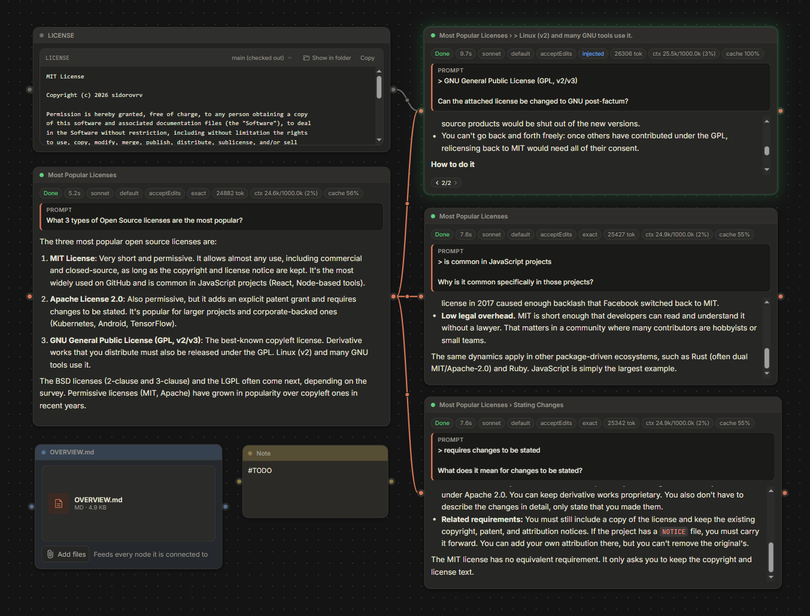

<p align="center">
  
</p>

<h1 align="center">Branchboard</h1>

<p align="center">
  A whiteboard diagram-style canvas for AI chats.
</p>

<p align="center">
  
</p>

---

Branchboard is a local web app that uses the `claude` or `opencode` command-line tool. Instead of one long chat thread, you have a board where you can run several chats side by side on a diagram-like canvas, fork a turn to try another direction, and connect the answers you want to build further on. Boards are stored on your machine.

## Features

- **Wires set context.** Connecting one node to another adds its context to the other node's prompt.
- **Branching.** Fork any turn to explore different options.
- **Context control.** Combine nodes' and branches' answers later to start a chat based on their combined context.
- **Code nodes.** Inspect changes and produced files right on the board. Pass them as context to other nodes with a simple connect.
- **Tables & graphs.** See and interact with tables and graphs right in the node's answer.

## Get started

You need either the [`claude`](https://code.claude.com) command or [`opencode`](https://opencode.ai), on Windows, macOS or Linux.

**With npm** (Node.js 22.13 or newer):

```bash
npx branchboard
```

Or install it once and start it any time with `branchboard`:

```bash
npm install -g branchboard
```

**As a single file, no Node.js needed:** download the file for your system from the [Releases](../../releases) page and run it.

| System | File |
|---|---|
| Windows | `branchboard-win32-x64.exe` |
| macOS (Apple Silicon / Intel) | `branchboard-darwin-arm64` / `branchboard-darwin-x64` |
| Linux | `branchboard-linux-x64` / `branchboard-linux-arm64` |

On macOS and Linux, run `chmod +x` on the file first.

Branchboard opens your browser with a private token link. Keep that link to yourself: it is what lets the browser talk to the app on your machine.

### Launch with Claude

1. Install [Claude Code](https://code.claude.com) and run `claude` once to sign in.
2. Start Branchboard with `npx branchboard`.
3. Create a project, pick your project folder and choose the Claude runtime.
4. If `claude` is not on your PATH, set `BRANCHBOARD_CLAUDE_PATH` to its location first.

### Launch with OpenCode

1. Install [OpenCode](https://opencode.ai) and connect a provider with `opencode auth login`.
2. Start Branchboard with `npx branchboard`.
3. Create a project, pick your project folder and choose the OpenCode runtime. Branchboard starts `opencode serve` for the folder itself.
4. If `opencode` is not on your PATH, set `BRANCHBOARD_OPENCODE_PATH` to its location first.

## Options

```
branchboard [options]

  --port <number>    Port to listen on (default 4777)
  --data-dir <dir>   Folder for boards and logs
  --no-open          Do not open the browser
  -v, --version      Print the version
  -h, --help         Print this help
```

Boards are stored in `%LOCALAPPDATA%\Branchboard` on Windows, `~/Library/Application Support/Branchboard` on macOS and `~/.local/share/branchboard` on Linux.

## Using your Claude subscription

The Claude runtime starts the `claude` command already installed on your machine, signed in the way you set it up. Branchboard never reads or stores your credentials. Check Anthropic's [legal and compliance terms](https://code.claude.com/docs/en/legal-and-compliance) for third-party tools before using it.

## License

[MIT](LICENSE)
